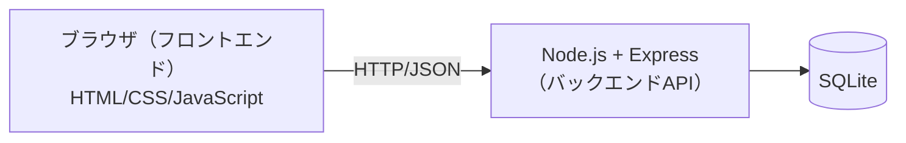
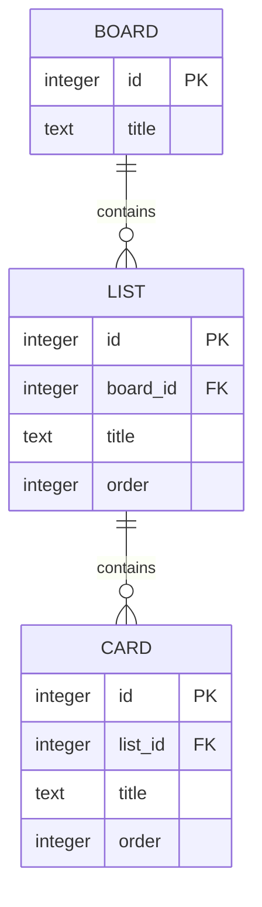

# データベース設計

使用技術（Node.js / Express / SQLite）の選定理由は [技術スタック](./tech-stack.md) を参照。

## システム構成

- フロントエンドはAPI（例: `GET /boards`, `POST /cards`, `PATCH /cards/:id`, `DELETE /cards/:id`）経由でデータを取得・更新する
- バックエンドがSQLiteへの読み書きを担当し、フロントエンドは直接DBにアクセスしない

## データ構造（ER図）

## 補足

- SQLiteのテーブルは `boards` / `lists` / `cards` の3つを想定し、`lists.board_id` と `cards.list_id` で親を参照する（外部キー）
- `order` はフェーズ2以降の「同一列内での並び替え」実装時に使用する並び順
- id はSQLiteの `INTEGER PRIMARY KEY`（自動採番）とする
- フェーズ1では画面上のメモリ内データで動作させ、フェーズ2でバックエンドAPIを実装し、この構造のままSQLiteへの保存・読み込みに切り替える
