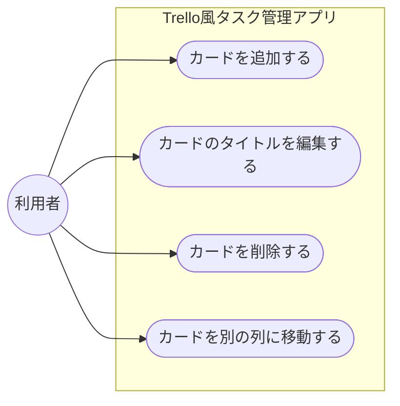

# 機能要件

機能の一覧は [機能一覧](./features.md) を参照。

## 受け入れ基準

フェーズ1（基本機能）について、以下をすべて満たした時点で完成とする。

- [ ] 「未着手」「進行中」「完了」の3列がブラウザ上に表示される
- [ ] 任意の列にカードを新規追加できる
- [ ] 追加したカードのタイトルを編集できる
- [ ] カードを削除できる
- [ ] カードを別の列に移動できる
- [ ] 上記の操作をエラーなく繰り返し行える

## ユースケース

アクターは「利用者（自分）」の1人のみ。Mermaidに正式なユースケース図の記法はないため、`flowchart`で代用する（楕円＝ユースケース）。

| ユースケース | 概要 | 関連する受け入れ基準 |
| --- | --- | --- |
| カードを追加する | 任意の列に新しいカードを作成する | 任意の列にカードを新規追加できる |
| カードのタイトルを編集する | 既存カードのタイトルを書き換える | 追加したカードのタイトルを編集できる |
| カードを削除する | 不要になったカードを削除する | カードを削除できる |
| カードを別の列に移動する | カードの進捗状況（列）を変更する | カードを別の列に移動できる |

画面上での具体的な操作は [画面設計](./screen-design.md) を参照。
