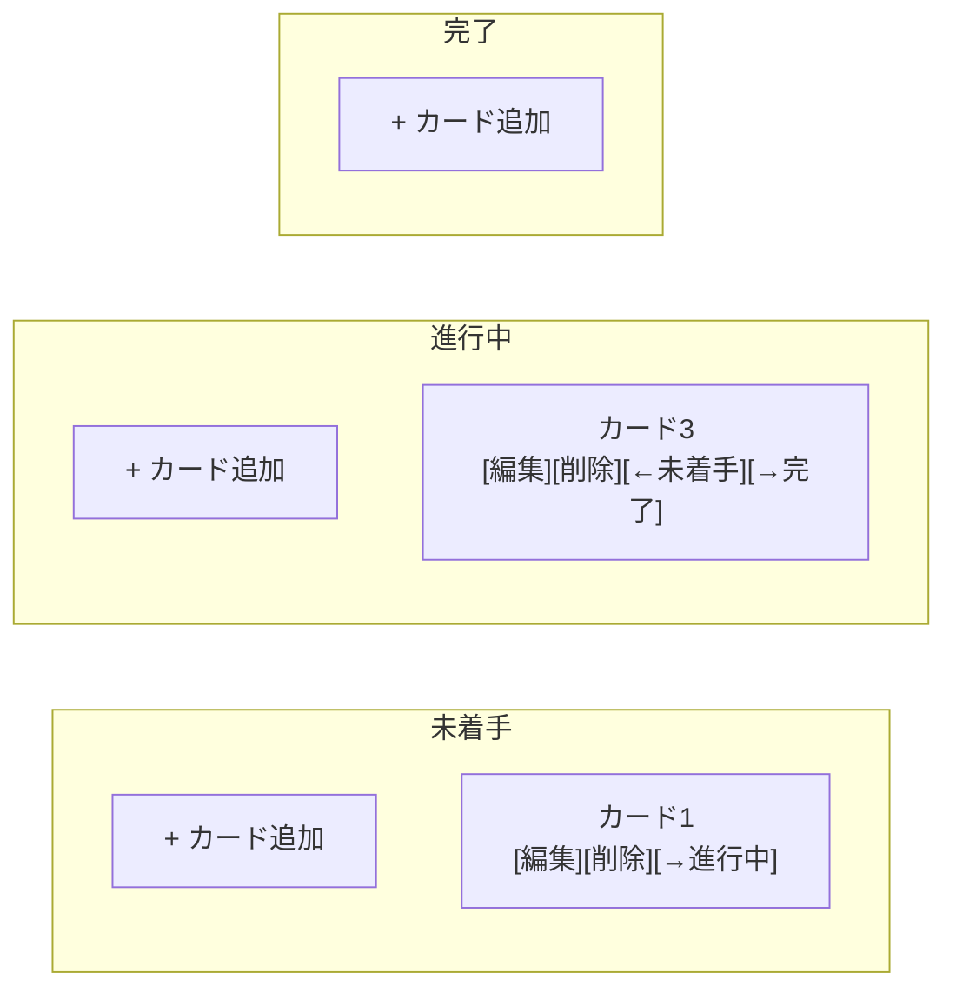
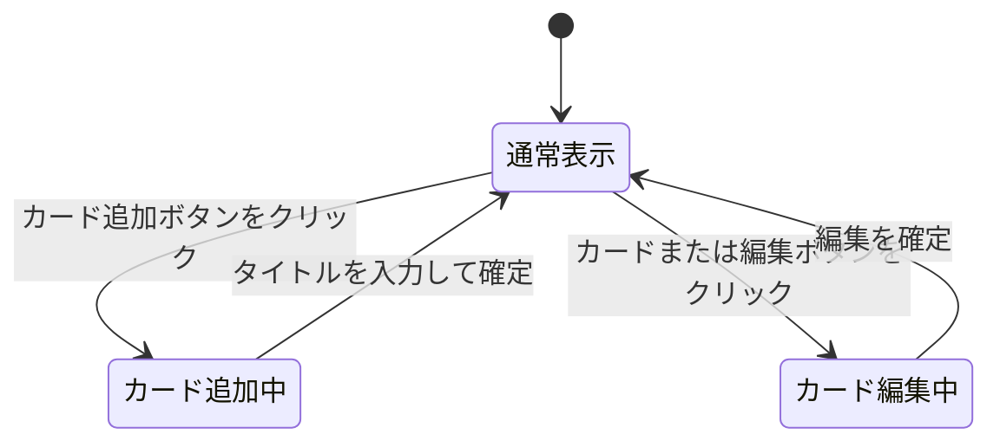
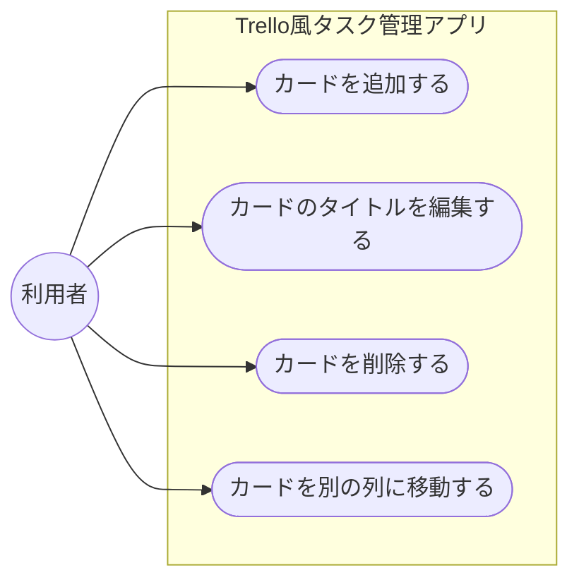
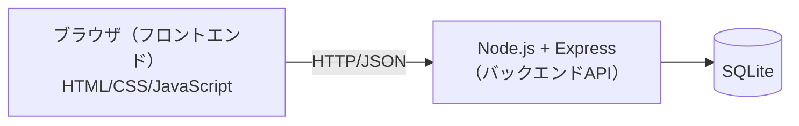
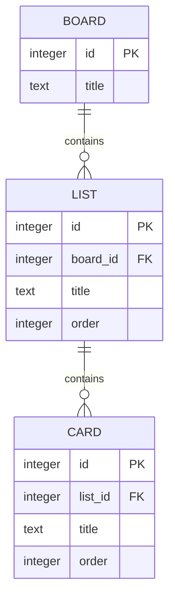

# Trello風タスク管理アプリ 要件定義書

## 1. 概要

### 背景・課題
タスク管理に付箋やメモ帳を使っていたが、進捗状況（未着手・進行中・完了）が一目で分かりにくく、抜け漏れが発生しやすい。Trelloのような視覚的なカンバン形式であれば、タスクの状態が直感的に把握できる。

### 目的
学習目的で、Trello風のシンプルなタスク管理アプリを作成する。

### 想定利用者
自分一人での利用を想定する。ブラウザ上で動作し、ログインは不要。

### 用語定義

| 用語 | 説明 |
| --- | --- |
| ボード | アプリ全体の作業スペース。列の集まり。 |
| 列（リスト） | タスクの進捗状況を表す区分。「未着手」「進行中」「完了」の3つ。 |
| カード | 1つのタスクを表す単位。列の中に配置される。 |

## 2. 機能要件

### フェーズ1（基本機能）
- 列（未着手 / 進行中 / 完了）の表示
- カードの追加
- カードの削除
- カードの編集（タイトル変更）
- カードを別の列に移動

### 受け入れ基準

フェーズ1（基本機能）について、以下をすべて満たした時点で完成とする。

- [ ] 「未着手」「進行中」「完了」の3列がブラウザ上に表示される
- [ ] 任意の列にカードを新規追加できる
- [ ] 追加したカードのタイトルを編集できる
- [ ] カードを削除できる
- [ ] カードを別の列に移動できる
- [ ] 上記の操作をエラーなく繰り返し行える

## 3. 非機能要件
- フロントエンドはHTML / CSS / JavaScript（フレームワークなし）で実装する
- バックエンドはNode.js（Express）でAPIサーバーを構築する。データはサーバー側のSQLiteデータベースに保存する
- ローカル環境でNode.jsサーバーを起動して動作させる（本番環境へのデプロイは対象外）
- PC画面での表示を優先する（レイアウトの詳細は実装時に決定する）

## 4. 画面設計

### ボード画面（唯一の画面）

トップ画面（ボード画面）はカンバン形式とし、横に並んだ3つの列（未着手 / 進行中 / 完了）の中にカードが縦に並ぶレイアウトとする。

### 要素と操作

| 要素 | 説明 | 操作 |
| --- | --- | --- |
| 列見出し | 「未着手」「進行中」「完了」を表示 | なし（フェーズ1では固定） |
| カード追加ボタン | 各列の上部に配置 | クリックで入力欄を表示し、タイトルを入力して追加 |
| カード | タイトルと操作ボタンを表示 | クリックでタイトルを編集状態にする |
| 編集ボタン | カード内に配置 | クリックでタイトルをその場で編集可能にする |
| 削除ボタン | カード内に配置 | クリックでカードを削除する（確認なし） |
| 列移動ボタン | カード内に配置。隣の列がある場合のみ表示 | クリックで対象カードを隣の列へ移動する |

### 状態遷移

フェーズ1では画面は1枚のみで、カード単位の表示状態が変化する。

- 削除ボタン、列移動ボタンは通常表示のまま即座に処理され、状態遷移は発生しない

## 5. ユースケース

アクターは「利用者（自分）」の1人のみ。Mermaidに正式なユースケース図の記法はないため、`flowchart`で代用する（楕円＝ユースケース）。

| ユースケース | 概要 | 関連する受け入れ基準 |
| --- | --- | --- |
| カードを追加する | 任意の列に新しいカードを作成する | 任意の列にカードを新規追加できる |
| カードのタイトルを編集する | 既存カードのタイトルを書き換える | 追加したカードのタイトルを編集できる |
| カードを削除する | 不要になったカードを削除する | カードを削除できる |
| カードを別の列に移動する | カードの進捗状況（列）を変更する | カードを別の列に移動できる |

## 6. データ設計

### システム構成

- フロントエンドはAPI（例: `GET /boards`, `POST /cards`, `PATCH /cards/:id`, `DELETE /cards/:id`）経由でデータを取得・更新する
- バックエンドがSQLiteへの読み書きを担当し、フロントエンドは直接DBにアクセスしない

### データ構造（ER図）

### 補足

- SQLiteのテーブルは `boards` / `lists` / `cards` の3つを想定し、`lists.board_id` と `cards.list_id` で親を参照する（外部キー）
- `order` はフェーズ2以降の「同一列内での並び替え」実装時に使用する並び順
- id はSQLiteの `INTEGER PRIMARY KEY`（自動採番）とする
- フェーズ1では画面上のメモリ内データで動作させ、フェーズ2でバックエンドAPIを実装し、この構造のままSQLiteへの保存・読み込みに切り替える

## 7. 技術選定

| 項目 | 選定技術 |
| --- | --- |
| フロントエンド | HTML / CSS / JavaScript（フレームワークなし） |
| バックエンド | Node.js + Express |
| データ保存 | SQLite（バックエンド経由） |
| ビルド・開発環境 | ビルドツールなし（フロントは静的ファイル、バックエンドはNode.jsで直接実行） |

## 8. 拡張候補

フェーズ2以降の拡張機能。実装順:
1. カード移動をボタン方式からドラッグ&ドロップに変更
2. データ保存（バックエンドAPI経由でSQLiteへの保存・読み込み）
3. カードへのラベル付け（色分け）
4. カードの詳細情報（説明文・期限・担当者）
5. 同一列内でのカードの並び替え
6. 列の追加・削除・名前変更
7. 検索・絞り込み
8. 複数ボードの管理

## 9. 制約事項
- 複数ユーザー・ログイン機能は対象外
- インターネット上への公開・本番デプロイは対象外
