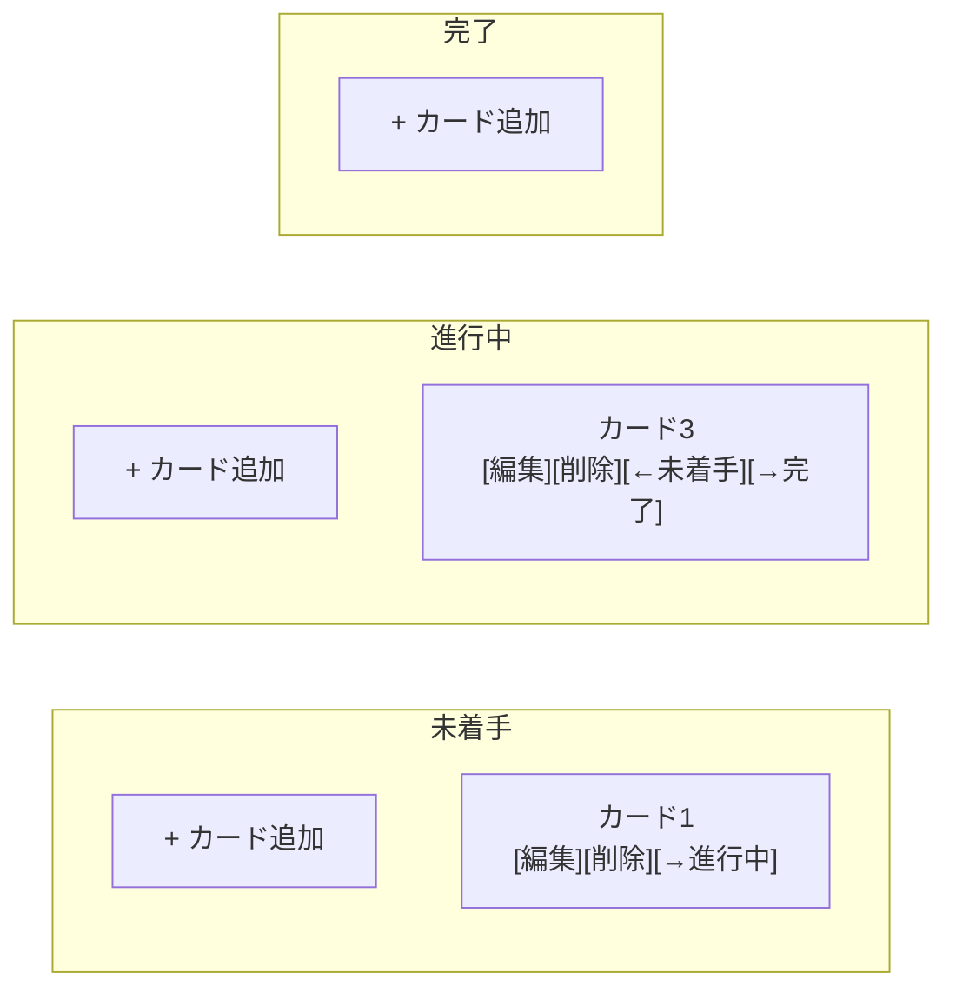
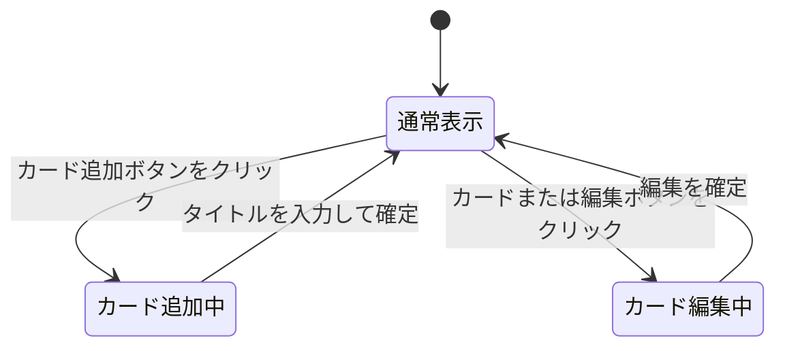

# 画面設計

対応する機能・受け入れ基準は [機能要件](./functional-requirements.md) を参照。

## ボード画面（唯一の画面）

トップ画面（ボード画面）はカンバン形式とし、横に並んだ3つの列（未着手 / 進行中 / 完了）の中にカードが縦に並ぶレイアウトとする。

## 要素と操作

| 要素 | 説明 | 操作 |
| --- | --- | --- |
| 列見出し | 「未着手」「進行中」「完了」を表示 | なし（フェーズ1では固定） |
| カード追加ボタン | 各列の上部に配置 | クリックで入力欄を表示し、タイトルを入力して追加 |
| カード | タイトルと操作ボタンを表示 | クリックでタイトルを編集状態にする |
| 編集ボタン | カード内に配置 | クリックでタイトルをその場で編集可能にする |
| 削除ボタン | カード内に配置 | クリックでカードを削除する（確認なし） |
| 列移動ボタン | カード内に配置。隣の列がある場合のみ表示 | クリックで対象カードを隣の列へ移動する |

## 状態遷移

フェーズ1では画面は1枚のみで、カード単位の表示状態が変化する。

- 削除ボタン、列移動ボタンは通常表示のまま即座に処理され、状態遷移は発生しない
